# 1、项目设计

## （1）项目总体构成

## （2）引入的包在项目中的作用相关说明

### （a）express

### （b）ejs

### （c）mongoose

### （d）express-session

### （f）moment

## （3）项目目录结构和各个部分的说明

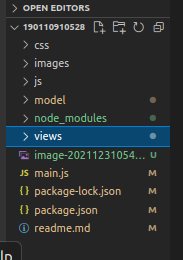

# 2、使用说明书

## 1）功能分析

####  	（a）普通用户

​	a）注册账户

​	b）登录账户

​	c）报名课程

​	d）查看自己的课表

​	e）查看用户信息

​	f）查看课程教室信息

​	e）登出账户

#### 	（b）管理员（用户名：admin，密码：123456）

​	a.登录账户

​	b.为课程申请教室

​	c.进行普通用户的所有操作

## 2）功能实际操作

#### （a）普通用户

​	a）注册账户

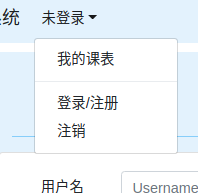

点击左上角的“未登录”，展开下拉框，点击“登录/注册“，进入登录/注册页面：

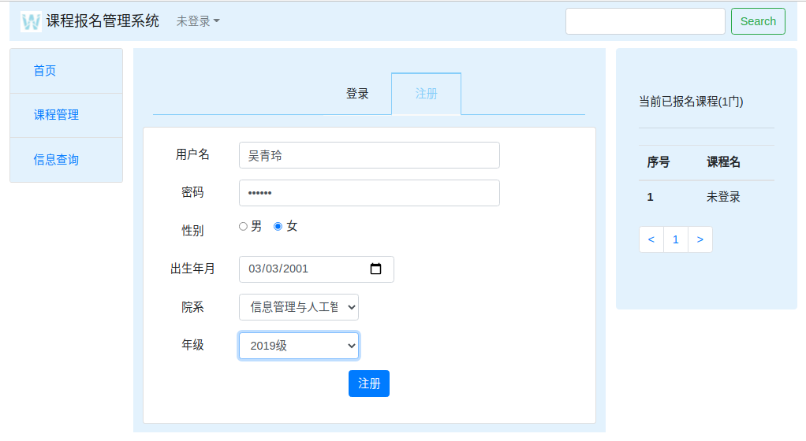

注册成功，数据库插入一条用户信息：

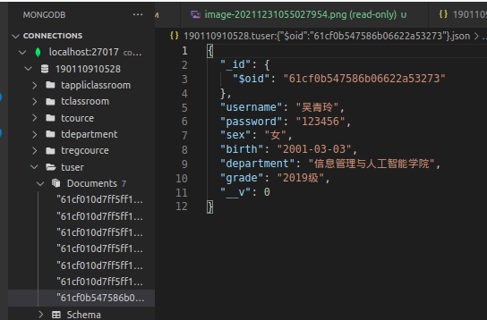

​	b）登录账户

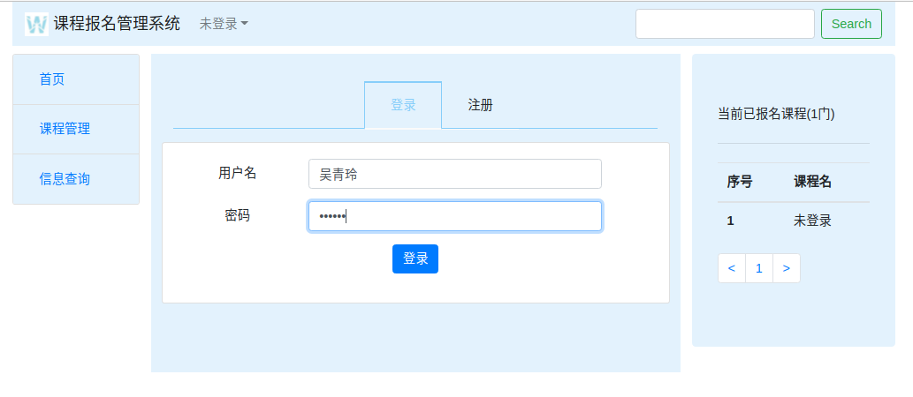

账户登录成功，左上角的”未登录“，变成当前登录账户的用户名：

登录的是普通用户，点击左边栏目的“课程教室申请”，提示没有权限：

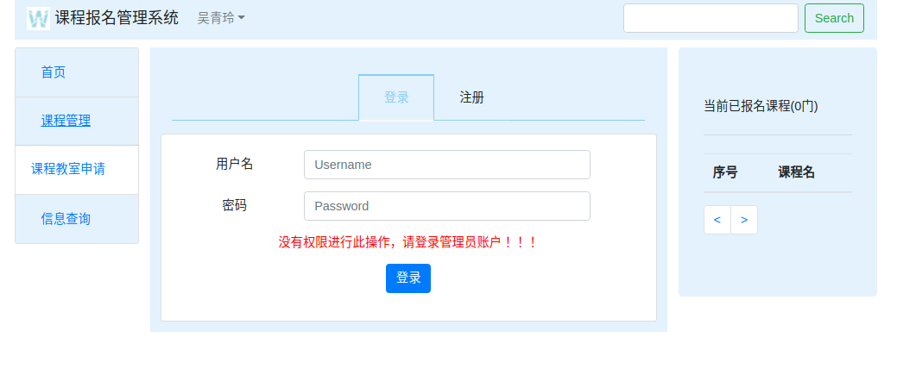	

​	c）报名课程

点击左边栏目的“课程查询“，进入课程列表页面，可点击”报名“按钮报名课程，报名成功，按钮变成蓝色的”取消“，右边栏目实时显示当前用户报名课程的情况：

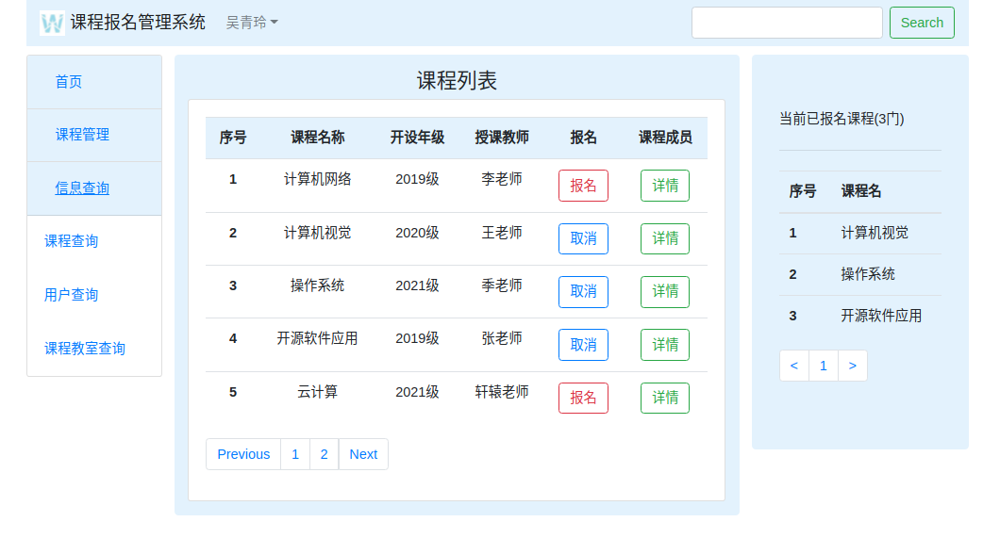

点击“取消”，取消报名该课程，按钮重新变回红色的“报名“按钮：

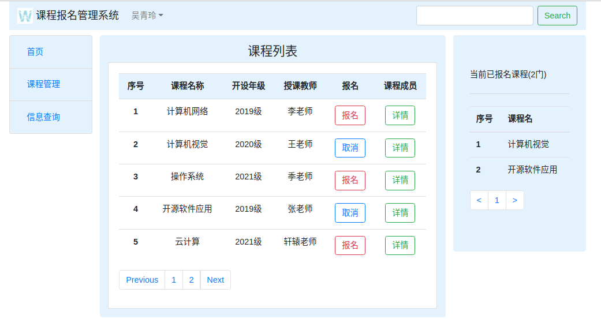

点击绿色”详情“，查看该课程报名的成员：

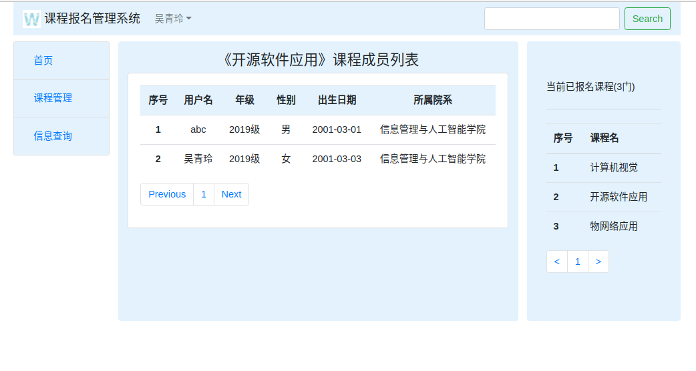

列表左下角的翻页按钮，点击可翻页，可左右翻页，也可跳转翻页：

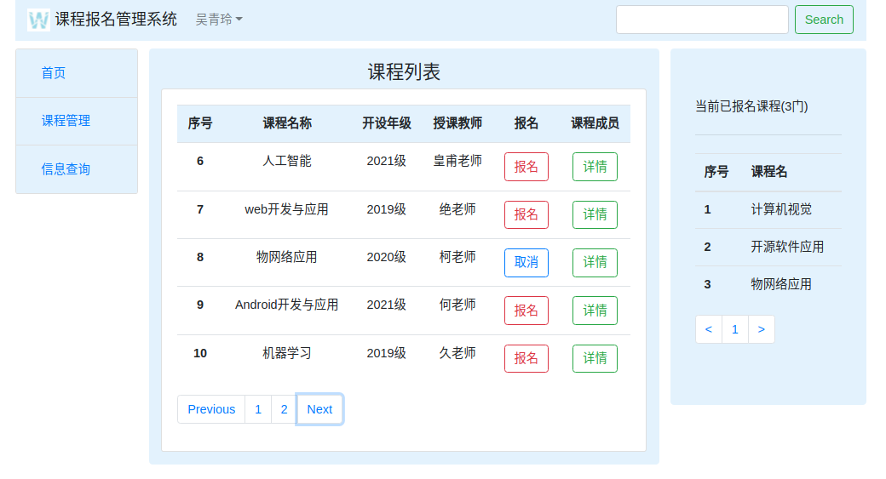	

d）查看自己的课表

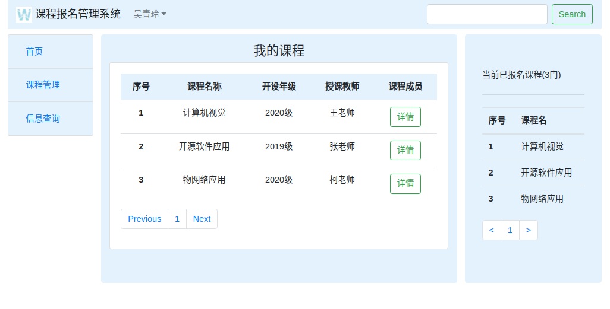

​	e）查看用户信息

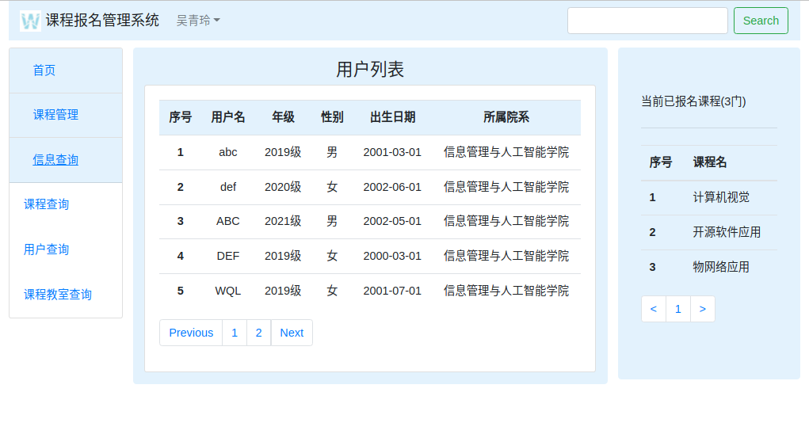

​	f）查看课程教室信息

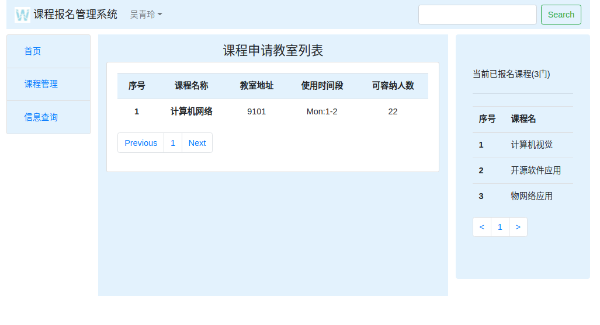

​	e）登出账户

登出账户，不能进行除登录/注册以外的任何操作：

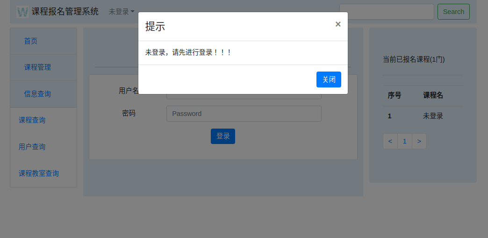

#### 	（b）管理员（用户名：admin，密码：123456）

​	a.登录账户

和普通用户相同

​	b.为课程申请教室

选择要申请的课程，课程想使用的教室，以及课程想要使用的时间段：

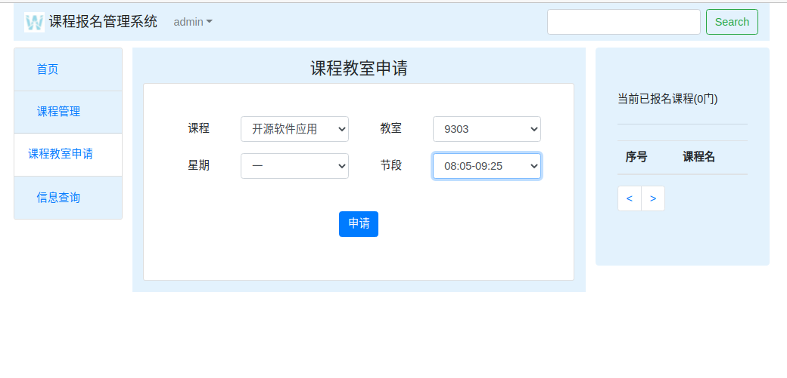

申请完毕，申请列表上出现申请记录：

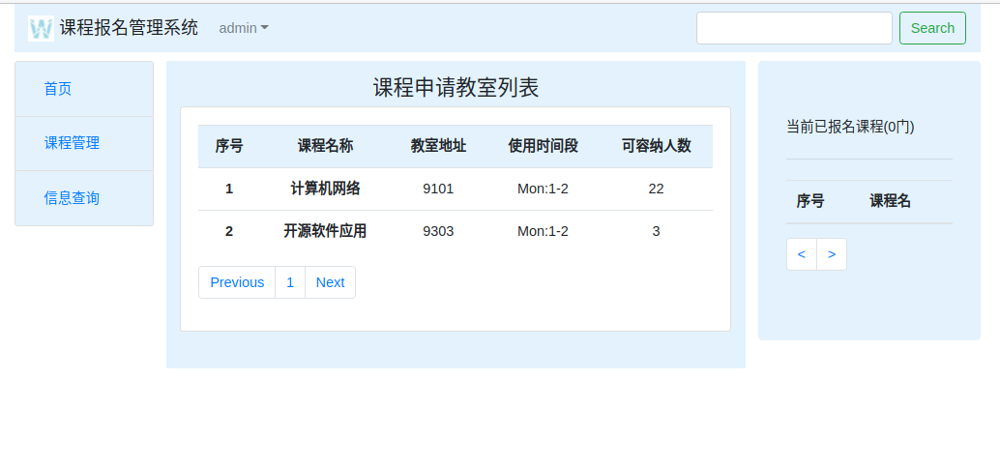	

​	c.进行普通用户的所有操作

和普通用户相同

# 3、开发日记（与commit对应）

####12.29

1）完成首页、登录/注册页面的制作，实现页面跳转 

2）设计数据库，为每张表插入初始数据

####12.29 19:49

1）实现与数据库关联的登录、注册操作

####12.30 19:35

实现以下功能：

1）课程申请教室

2）查询所有课程、课程教室申请信息

3）报名课程，报名信息成功插入数据库，但页面按钮状态转化未完成

####12.31 21:35

实现以下功能：

1）报名课程按钮：实现预期效果，状态随报名或取消报名流畅转换

2）我的课表功能：可查看当前用户的课表，右边栏目随时显示当前用户的课表

3）可查看所有用户列表

4）实现翻页功能

5）实现权限限制：未登录不能进行除登录注册外的其他所有操作，普通用户可查看信息、报名课程，但不能进行课程申请教室的操作，管理员可进行所有操作
