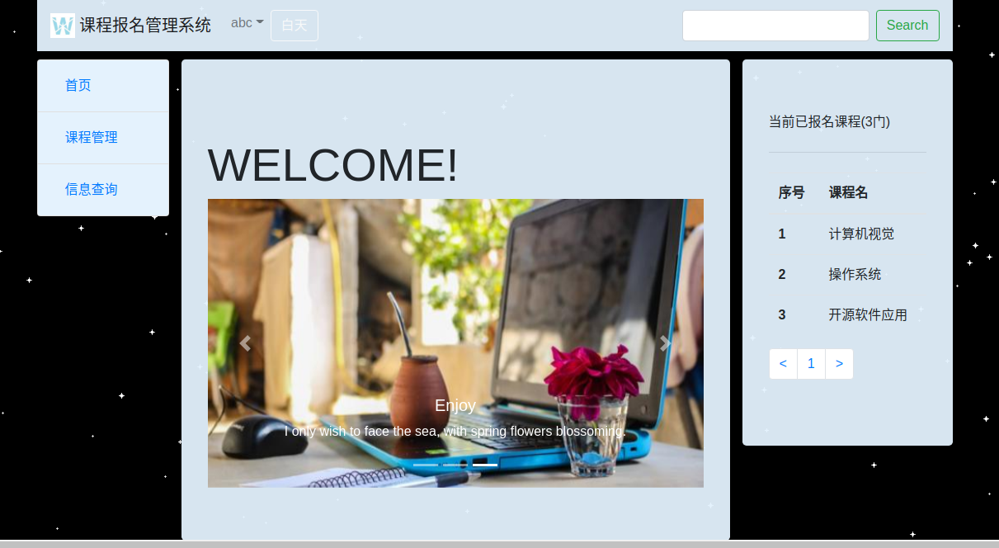

# 1、项目设计

## （1）项目总体构成

项目总体包括三大部分：

（a）前端页面设计：采用boostrap框架模板完成

（b）后端数据处理：采用express、mongoose、express-session、moment框架模板完成

（c）前后端数据交互响应：采用express、ejs框架完成

## （2）引入的包在项目中的作用相关说明

#### （a）express

实现网页路由的选择和控制

#### （b）ejs

实现页面渲染、后端数据到前端的渲染

#### （c）mongoose

实现数据的插入、删除、查询操作

#### （d）express-session

实现数据的暂时留存，达到某项数据在任意路由上传递流通的目的

#### （f）moment

实现账户出生日期的格式化

## （3）项目目录结构和各个部分的说明

#### （a）css、images、js

采用bootstrap框架模板完成页面设计，有系统loge和三张首页轮播的图片。

#### （b）model

db.js：调用mongoose，连接相应数据集的接口

每张表都有一个Schema映射的接口：

a）用户表：user.js

b）课程表：cource.js

c）院系表：department.js

d）教室表：classroom.js

e）课程报名表：regcource.js

f）教室申请表：appliclassroom.js

#### （e）views

页面公共部分分离出来，单独放在一个文件里，完整页面通过ejs调用公共部分

##### 1）公共部分：

a）导航栏：header.ejs

b）左边栏目：left.ejs

c）右边栏目：right.ejs

d）bootstrap框架文件导入：script.ejs

e）模态框（提示框）：modal.ejs

##### 2）完整页面：

a）首页：index.ejs

b）用户登录/注册页面：loginorreg.ejs

c）课程列表页面：courcelist.ejs

d）课程报名成员列表页面：courceuserlist.ejs

e）用户列表页面：userlist.ejs

f）课程申请教室页面：classroomappli.ejs

g）课程申请教室列表页面：applicationlist.ejs

#### （f）main.js

用路由控制实现页面之间的跳转，根据需要实现对数据的插入、删除、查询操作，再根据需要将查询到的数据渲染到前端页面上。

# 2、使用说明书

## （1）功能分析

####  	（a）普通用户

​	a）注册账户

​	b）登录账户

​	c）报名课程

​	d）查看自己的课表

​	e）查看用户信息

​	f）查看课程教室信息

​	e）登出账户

#### 	（b）管理员（用户名：admin，密码：123456）

​	a）登录账户

​	b）为课程申请教室

​	c）进行普通用户的所有操作

#### （c）页面美化功能

​	a）背景白天黑夜切换（黑夜星空闪烁功能，采用github上的资源实现，github网址：https://github.com/YUUXIAO/webProject/tree/master/starBlink）

## （2）功能实际操作

#### （a）普通用户

##### 	a）注册账户

点击左上角的“未登录”，展开下拉框，点击“登录/注册“，进入登录/注册页面：

注册成功，数据库插入一条用户信息：

##### 	b）登录账户

账户登录成功，左上角的”未登录“，变成当前登录账户的用户名：

登录的是普通用户，点击左边栏目的“课程教室申请”，提示没有权限：

	

##### 	c）报名课程

点击左边栏目的“课程查询“，进入课程列表页面，可点击”报名“按钮报名课程，报名成功，按钮变成蓝色的”取消“，右边栏目实时显示当前用户报名课程的情况：

点击“取消”，取消报名该课程，按钮重新变回红色的“报名“按钮：

点击绿色”详情“，查看该课程报名的成员：

列表左下角的翻页按钮，点击可翻页，可左右翻页，也可跳转翻页：

	

##### d）查看自己的课表

##### 	e）查看用户信息

##### 	f）查看课程教室信息

##### 	e）登出账户

登出账户，不能进行除登录/注册以外的任何操作：

#### 	（b）管理员（用户名：admin，密码：123456）

##### 	a）登录账户

和普通用户相同

##### 	b）为课程申请教室

选择要申请的课程，课程想使用的教室，以及课程想要使用的时间段：

申请完毕，申请列表上出现申请记录：

	

##### 	c）进行普通用户的所有操作

和普通用户相同

#### （c）页面美化功能

a）白天黑夜切换

# 3、开发日记（与commit对应）

#### ####12.29

1）完成首页、登录/注册页面的制作，实现页面跳转 

2）设计数据库，为每张表插入初始数据

#### ####12.29 19:49

1）实现与数据库关联的登录、注册操作

#### ####12.30 19:35

实现以下功能：

1）课程申请教室

2）查询所有课程、课程教室申请信息

3）报名课程，报名信息成功插入数据库，但页面按钮状态转化未完成

#### ####12.31 21:35

实现以下功能：

1）报名课程按钮：实现预期效果，状态随报名或取消报名流畅转换

2）我的课表功能：可查看当前用户的课表，右边栏目随时显示当前用户的课表

3）可查看所有用户列表

4）实现翻页功能

5）实现权限限制：未登录不能进行除登录注册外的其他所有操作，普通用户可查看信息、报名课程，但不能进行课程申请教室的操作，管理员可进行所有操作

#### ####1.1 15:22

1）实现背景白天黑夜的切换，黑夜星空闪烁
